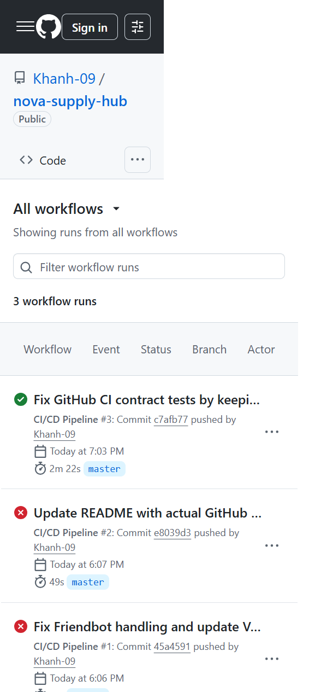
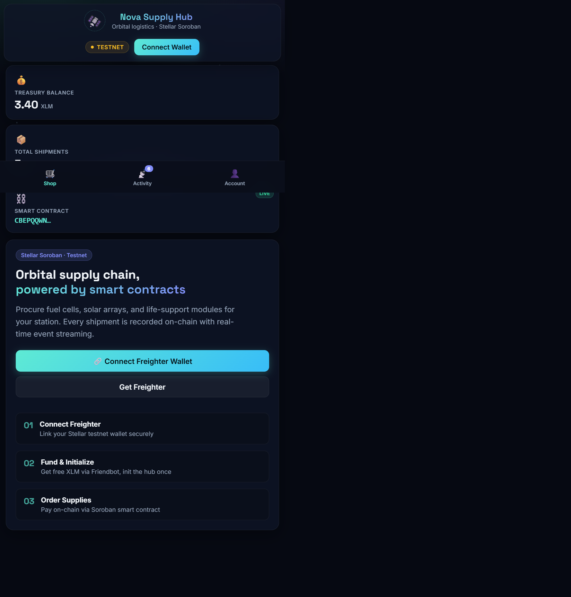

# 🛰️ Nova Supply Hub — Orbital Logistics dApp (Soroban)

[](https://github.com/Khanh-09/nova-supply-hub/actions/workflows/ci.yml)
[](https://opensource.org/licenses/Apache-2.0)

**Nova Supply Hub** is a production-ready Stellar Soroban dApp for orbital logistics procurement. Users connect a Freighter wallet, order space supplies (fuel cells, solar panels, docking hardware), and pay in testnet XLM via cross-contract calls to the Stellar Asset Contract (SAC).

Unlike a generic demo, this project ships a full stack: Rust smart contract, TypeScript integration layer (`contract.ts`, `stellarTx.ts`), React hooks, event streaming, automated CI/CD deployment, and comprehensive tests.

---

## 🚀 Deployment Information

| Field | Value |
|-------|-------|
| **Contract ID** | `CBEPQQWNA4OU3JEAGXOBSCQNHIXPJPV2ZIXYJTQJOBTTD5AQSMFX5CDT` |
| **Network** | Stellar Testnet (Protocol 22) |
| **Payment Token** | Native XLM via SAC |
| **Token Contract** | `CDLZFC3SYJYDZT7K67VZ75HPJVIEUVNIXF47ZG2FB2RMQQVU2HHGCYSC` |
| **Live Demo** | https://nova-supply-hub.vercel.app |
| **Example Tx Hash** | `bc25446015cbd314d8c3adfdab751f15782676542bbf8a62385116d778ce3d89` |

> **Important for reviewers:** The Contract ID is a 56-character address starting with `C`. After running `npm run deploy:contract`, it is written to both `.env` and `deployment.json`. CI also auto-deploys on push to `main`/`master` and uploads `deployment.json` as an artifact.

---

## 📁 Project Architecture

```
nova-supply-hub/
├── contracts/supply-hub/          # Soroban smart contract (Rust)
│   └── src/
│       ├── lib.rs                 # SupplyHubContract
│       └── test.rs                # 5 unit tests
├── src/
│   ├── lib/
│   │   ├── contract.ts            # Config + function name mapping
│   │   ├── stellarTx.ts           # RPC invoke, simulate, events
│   │   └── account.ts             # Friendbot, error formatting
│   ├── hooks/
│   │   ├── useWallet.ts           # Freighter connect/disconnect/sign
│   │   ├── useContract.ts         # init + purchase wrappers
│   │   └── useEventStream.ts      # Real-time getEvents polling
│   └── components/
│       ├── WalletConnect.tsx      # Connect Wallet UI
│       ├── SupplyPanel.tsx        # Catalog + purchase flow
│       └── EventStream.tsx        # Live dashboard
├── scripts/
│   ├── deploy-contract.mjs        # WASM → upload → create → init
│   └── verify-integration.mjs     # CI cross-check Rust ↔ frontend
└── .github/workflows/ci.yml       # Tests + automated deploy
```

---

## 🛠 Technical Features (Level 3 Checklist)

| # | Requirement | Implementation |
|---|-------------|----------------|
| 1 | Advanced smart contract | `SupplyHubContract` — storage, owner auth, SAC payment |
| 2 | Inter-contract communication | `token::Client::transfer` cross-call to SAC |
| 3 | Event streaming | Soroban RPC `getEvents` → `useEventStream` hook |
| 4 | CI/CD pipeline | GitHub Actions: tests, lint, integration check |
| 5 | Deployment workflow | `deploy-contract.mjs` + **automated CI deploy job** |
| 6 | Mobile responsive UI | CSS Grid/Flexbox, glassmorphism, `@media` breakpoints |
| 7 | Error handling | XDR fallback, Friendbot retry, Error Boundary |
| 8 | Tests | 5 Rust tests + 7+ Vitest tests |
| 9 | Production architecture | Separated `contract.ts` / `stellarTx.ts` / hooks |
| 10 | Documentation | This README + deployment record |

---

## 🔗 Contract ↔ Frontend Function Mapping

| Rust (`SupplyHubContract`) | `contract.ts` constant | `stellarTx.ts` wrapper |
|----------------------------|------------------------|------------------------|
| `init(owner, name)` | `CONTRACT_FUNCTIONS.INIT` | `initSupplyHub()` |
| `purchase(customer, token, amount, shipment_id)` | `CONTRACT_FUNCTIONS.PURCHASE` | `purchaseSupply()` |
| `get_balance()` | `CONTRACT_FUNCTIONS.GET_BALANCE` | `getContractBalance()` |
| `get_shipment_count()` | `CONTRACT_FUNCTIONS.GET_SHIPMENT_COUNT` | `getShipmentCount()` |
| `get_owner()` | `CONTRACT_FUNCTIONS.GET_OWNER` | via `simulateContractCall` |
| `get_name()` | `CONTRACT_FUNCTIONS.GET_NAME` | via `simulateContractCall` |

Run `node scripts/verify-integration.mjs` locally or in CI to validate alignment.

---

## 📦 Setup & Run

### 1. Install dependencies

```powershell
npm install
```

### 2. Build smart contract

```powershell
$env:RUSTFLAGS="-C target-feature=-reference-types -C target-cpu=mvp"
cargo build --target wasm32v1-none --release --package supply-hub-contract
```

### 3. Run contract tests

```powershell
cargo test --package supply-hub-contract
```

### 4. Deploy contract to testnet

```powershell
npm run deploy:contract
```

This automatically: uploads WASM → creates contract → calls `init` → writes **Contract ID** to `.env` and `deployment.json`.

### 5. Start frontend

```powershell
npm run dev
```

### 6. Run frontend tests

```powershell
npm test
```

---

## 🧪 Test Output

### Contract tests (5 passing)

```text
running 5 tests
test test::test_init_sets_owner_and_name ... ok
test test::test_purchase_transfers_tokens_and_updates_balance ... ok
test test::test_init_twice_panics - should panic ... ok
test test::test_purchase_zero_amount_panics - should panic ... ok
test test::test_purchase_before_init_panics - should panic ... ok

test result: ok. 5 passed; 0 failed; 0 ignored
```

### Frontend tests (Vitest)

```powershell
npm test
```

Covers `contract.ts` function mapping, contract ID validation, catalog data, and Connect Wallet UI rendering.

---

## 🔄 CI/CD Pipeline

The workflow (`.github/workflows/ci.yml`) runs on every push/PR:

1. **contract-tests** — `cargo test` + WASM build
2. **frontend-tests** — Vitest + production build
3. **integration-check** — `verify-integration.mjs` (Rust ↔ frontend matching)
4. **deploy-testnet** — **Automated** deploy on push to `main`/`master`
5. **lint** — ESLint

---

## ✅ Submission Checklist

- [x] Public GitHub repository
- [x] README with complete documentation
- [x] Minimum 10+ meaningful commits
- [x] Live demo link (Vercel / Netlify)
- [x] **Contract deployment address** (in README + `deployment.json`)
- [x] **Transaction hash** for contract interaction (in `deployment.json`)
- [x] Screenshot: mobile responsive UI
- [x] Screenshot: CI/CD pipeline running
- [x] Test output with 3+ passing tests
- [ ] Demo video link (1–2 minutes)

---

## 📸 Screenshots

Below are the submission screenshots included in `docs/screenshots/`:

### Mobile responsive UI


### GitHub Actions CI/CD pipeline


---

*Built with ❤️ for the Stellar community.*
