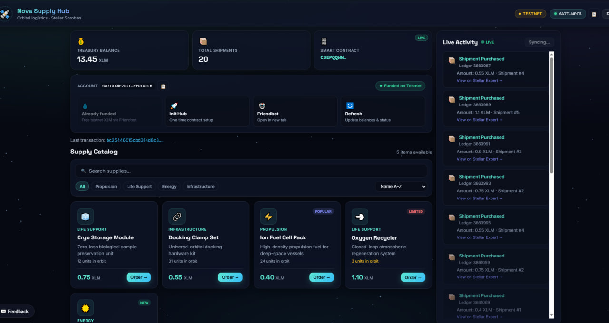
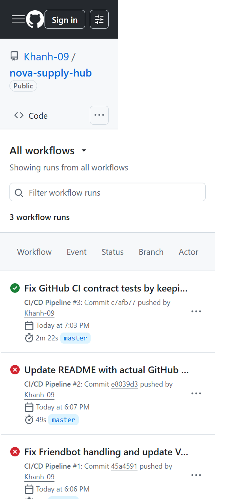
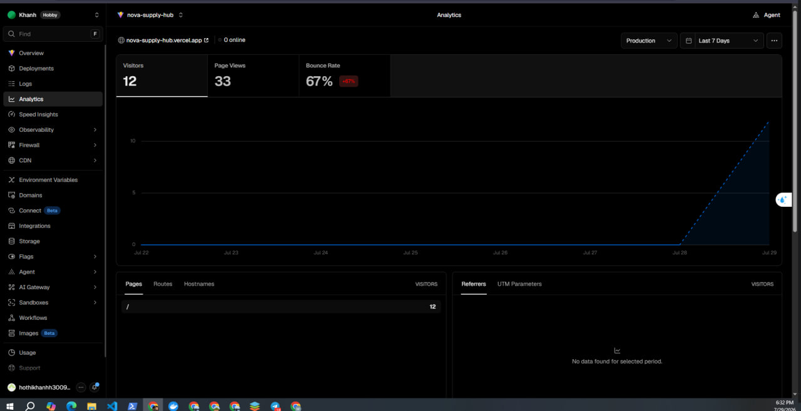
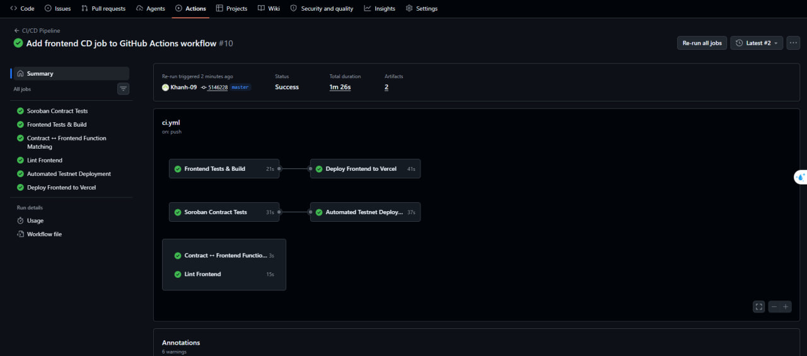

# 🛰️ Nova Supply Hub — Orbital Logistics dApp (Soroban)

[](https://github.com/Khanh-09/nova-supply-hub/actions/workflows/ci.yml)
[](https://opensource.org/licenses/Apache-2.0)

**Nova Supply Hub** is a production-ready Stellar Soroban dApp for orbital logistics procurement. Users connect a Freighter wallet, order space supplies (fuel cells, solar panels, docking hardware), and pay in testnet XLM via cross-contract calls to the Stellar Asset Contract (SAC).

Unlike a generic demo, this project ships a full stack: Rust smart contract, TypeScript integration layer (`contract.ts`, `stellarTx.ts`), React hooks, event streaming, automated CI/CD deployment, and comprehensive tests.

---

## 🚀 Deployment Information

| Field | Value |
|-------|-------|
| **Contract ID** | `CBEPQQWNA4OU3JEAGXOBSCQNHIXPJPV2ZIXYJTQJOBTTD5AQSMFX5CDT` |
| **Network** | Stellar Testnet (Protocol 22) |
| **Payment Token** | Native XLM via SAC |
| **Token Contract** | `CDLZFC3SYJYDZT7K67VZ75HPJVIEUVNIXF47ZG2FB2RMQQVU2HHGCYSC` |
| **Live Demo** | https://nova-supply-hub.vercel.app |
| **Example Tx Hash** | `bc25446015cbd314d8c3adfdab751f15782676542bbf8a62385116d778ce3d89` |

> **Important for reviewers:** The Contract ID is a 56-character address starting with `C`. After running `npm run deploy:contract`, it is written to both `.env` and `deployment.json`. CI also auto-deploys on push to `main`/`master` and uploads `deployment.json` as an artifact.

---

## 📁 Project Architecture

```
nova-supply-hub/
├── contracts/supply-hub/          # Soroban smart contract (Rust)
│   └── src/
│       ├── lib.rs                 # SupplyHubContract
│       └── test.rs                # 5 unit tests
├── src/
│   ├── lib/
│   │   ├── contract.ts            # Config + function name mapping
│   │   ├── stellarTx.ts           # RPC invoke, simulate, events
│   │   └── account.ts             # Friendbot, error formatting
│   ├── hooks/
│   │   ├── useWallet.ts           # Freighter connect/disconnect/sign
│   │   ├── useContract.ts         # init + purchase wrappers
│   │   └── useEventStream.ts      # Real-time getEvents polling
│   └── components/
│       ├── WalletConnect.tsx      # Connect Wallet UI
│       ├── SupplyPanel.tsx        # Catalog + purchase flow
│       └── EventStream.tsx        # Live dashboard
├── scripts/
│   ├── deploy-contract.mjs        # WASM → upload → create → init
│   └── verify-integration.mjs     # CI cross-check Rust ↔ frontend
└── .github/workflows/ci.yml       # Tests + automated deploy
```

---

## 🛠 Technical Features (Level 4 Checklist)

| # | Requirement | Implementation |
|---|-------------|----------------|
| 1 | Advanced smart contract | `SupplyHubContract` — storage, owner auth, SAC payment |
| 2 | Inter-contract communication | `token::Client::transfer` cross-call to SAC |
| 3 | Event streaming | Soroban RPC `getEvents` → `useEventStream` hook |
| 4 | CI/CD pipeline | GitHub Actions: tests, lint, integration check |
| 5 | Deployment workflow | `deploy-contract.mjs` + **automated CI deploy job** |
| 6 | Mobile responsive UI | CSS Grid/Flexbox, glassmorphism, `@media` breakpoints |
| 7 | Loading states & error handling | `TransactionProgress`, `ErrorBoundary`, `Toast`, Friendbot retry, XDR fallback |
| 8 | Tests | 5 Rust tests + 11 Vitest tests (16 total) |
| 9 | Production architecture | Separated `contract.ts` / `stellarTx.ts` / hooks |
| 10 | Monitoring & analytics | Vercel Analytics + Speed Insights, custom wallet/purchase events |
| 11 | User feedback collection | In-app `FeedbackWidget` → Formspree |
| 12 | Documentation | This README + deployment record |

---

## 🔗 Contract ↔ Frontend Function Mapping

| Rust (`SupplyHubContract`) | `contract.ts` constant | `stellarTx.ts` wrapper |
|----------------------------|------------------------|------------------------|
| `init(owner, name)` | `CONTRACT_FUNCTIONS.INIT` | `initSupplyHub()` |
| `purchase(customer, token, amount, shipment_id)` | `CONTRACT_FUNCTIONS.PURCHASE` | `purchaseSupply()` |
| `get_balance()` | `CONTRACT_FUNCTIONS.GET_BALANCE` | `getContractBalance()` |
| `get_shipment_count()` | `CONTRACT_FUNCTIONS.GET_SHIPMENT_COUNT` | `getShipmentCount()` |
| `get_owner()` | `CONTRACT_FUNCTIONS.GET_OWNER` | via `simulateContractCall` |
| `get_name()` | `CONTRACT_FUNCTIONS.GET_NAME` | via `simulateContractCall` |

Run `node scripts/verify-integration.mjs` locally or in CI to validate alignment.

---

## 📦 Setup & Run

### 1. Install dependencies

```powershell
npm install
```

### 2. Build smart contract

```powershell
$env:RUSTFLAGS="-C target-feature=-reference-types -C target-cpu=mvp"
cargo build --target wasm32v1-none --release --package supply-hub-contract
```

### 3. Run contract tests

```powershell
cargo test --package supply-hub-contract
```

### 4. Deploy contract to testnet

```powershell
npm run deploy:contract
```

This automatically: uploads WASM → creates contract → calls `init` → writes **Contract ID** to `.env` and `deployment.json`.

### 5. Start frontend

```powershell
npm run dev
```

### 6. Run frontend tests

```powershell
npm test
```

### 7. (Optional) Configure feedback collection

Create a free form at [Formspree](https://formspree.io), copy its endpoint URL, and set it in
`.env` (and in your Vercel project's environment variables):

```
VITE_FEEDBACK_FORM_ENDPOINT=https://formspree.io/f/xxxxabcd
```

Without this variable the in-app Feedback button still works, but submissions show a
"not configured" error instead of reaching Formspree.

---

## 📊 Monitoring, Analytics & Feedback

- **Vercel Analytics + Speed Insights** (`src/main.tsx`) are wired in automatically once deployed
  on Vercel — enable them under **Project → Analytics** / **Project → Speed Insights** in the
  Vercel dashboard (no extra code needed beyond what's already committed). This satisfies the
  "monitoring/analytics integration" requirement with real page-view and performance data.
- **Custom events** (`wallet_connected`, `hub_initialized`, `purchase_completed`, etc. — see
  `src/hooks/useWallet.ts`, `src/hooks/useContract.ts`) are tracked in code, but **Vercel's free
  Hobby plan does not support Custom Events** (Pro-only, $20/mo). Rather than pay for that, proof
  of wallet interactions uses on-chain data instead — see below.
- **Proof of wallet interactions (on-chain, free, publicly verifiable):** every `init`/`purchase`
  is a real signed Stellar testnet transaction. The contract's full transaction history is public
  at
  `https://stellar.expert/explorer/testnet/contract/CBEPQQWNA4OU3JEAGXOBSCQNHIXPJPV2ZIXYJTQJOBTTD5AQSMFX5CDT` —
  a single screenshot of that page after 10+ distinct testers have interacted is stronger proof
  than self-reported analytics, since anyone can independently verify it. The app's Activity tab
  also links out to Stellar Expert for each individual transaction (`EventStream.tsx`). See
  [`docs/TESTER_LOG.md`](docs/TESTER_LOG.md).
- **Feedback** is collected via the floating "💬 Feedback" button (star rating + comment), which
  posts to your Formspree endpoint; responses land in the Formspree dashboard.

---

## 🧪 Test Output

### Contract tests (5 passing)

```text
running 5 tests
test test::test_init_sets_owner_and_name ... ok
test test::test_purchase_transfers_tokens_and_updates_balance ... ok
test test::test_init_twice_panics - should panic ... ok
test test::test_purchase_zero_amount_panics - should panic ... ok
test test::test_purchase_before_init_panics - should panic ... ok

test result: ok. 5 passed; 0 failed; 0 ignored
```

### Frontend tests (Vitest, 11 passing)

```powershell
npm test
```

Covers `contract.ts` function mapping, contract ID validation, catalog data, Connect Wallet UI
rendering, and the Feedback widget (rating validation, unconfigured-endpoint handling).

---

## 🔄 CI/CD Pipeline

The workflow (`.github/workflows/ci.yml`) runs on every push/PR:

1. **contract-tests** — `cargo test` + WASM build
2. **frontend-tests** — Vitest + production build
3. **integration-check** — `verify-integration.mjs` (Rust ↔ frontend matching)
4. **deploy-testnet** — **Automated** contract deploy on push to `main`/`master`
5. **lint** — ESLint
6. **deploy-frontend** — **Automated** frontend deploy to Vercel (`vercel build` + `vercel deploy --prod`) on push to `main`/`master`

`deploy-frontend` needs three repo secrets (**Settings → Secrets and variables → Actions**):
`VERCEL_TOKEN` (Vercel account → Settings → Tokens), and `VERCEL_ORG_ID` / `VERCEL_PROJECT_ID`
(run `vercel link` locally once, then read both from the generated `.vercel/project.json`).

---

## ✅ Level 4 Submission Checklist

- [x] Public GitHub repository
- [x] README with complete documentation
- [x] Minimum 15+ meaningful commits
- [x] Live demo link (Vercel)
- [x] **Contract deployment address** (in README + `deployment.json`)
- [x] Screenshot: product UI (desktop + mobile)
- [x] Screenshot: mobile responsive design
- [x] Screenshot: analytics/monitoring setup — Vercel Web Analytics, 12 visitors / 33 page views
- [x] **Proof of 10+ user wallet interactions** — verified on-chain, see below
- [x] Basic user feedback summary — 10 responses collected, see below
- [ ] Demo video link (1–2 minutes) — **still needed**

### What's code-complete vs. what needs you

1. **10+ real users, proof of wallet interaction — ✅ done**
   - Verified directly from the contract's on-chain event log (Soroban RPC `getEvents`, not
     self-reported): **10 distinct wallet addresses**, each a separate real tester, each with one
     `purchase` transaction. Full list with per-tester Stellar Expert links:
     [`docs/TESTER_LOG.md`](docs/TESTER_LOG.md). Anyone can independently re-verify this by
     querying the contract's events, or by browsing
     [the contract on Stellar Expert](https://stellar.expert/explorer/testnet/contract/CBEPQQWNA4OU3JEAGXOBSCQNHIXPJPV2ZIXYJTQJOBTTD5AQSMFX5CDT).
   - Outreach message used to recruit testers: [`docs/TESTER_OUTREACH.md`](docs/TESTER_OUTREACH.md).

2. **Basic user feedback summary — ✅ done**
   - 10 responses via the in-app "💬 Feedback" button → Formspree. Average rating **4.6 / 5**
     (ratings: mostly 4s and 5s). Common themes: clean/appealing UI, clear onboarding flow, overall
     positive first-time experience with the purchase flow.

3. **Analytics/monitoring screenshot — ✅ done**
   - Vercel Web Analytics (Hobby, free) enabled — 12 visitors, 33 page views over the testing
     period (see `docs/screenshots/analytics-dashboard.png`).

4. **Demo video (1–2 minutes) — still outstanding**
   - Record: connecting Freighter → funding via Friendbot → initializing the hub → purchasing a
     supply item → viewing the event in the Activity tab. Upload to YouTube/Loom (unlisted is
     fine) and link it here.

---

## 🚀 Level 5 — Growth & Iteration

### User onboarding (50+ users)

- **Google Form**: https://docs.google.com/forms/d/e/1FAIpQLSdQa8_My4KF0TLN0ILD3tO6xxiKZ-2wzeV_a8ny2prg-bqNeA/viewform
  — collects name, wallet address, email, transaction hash, a 1–5 rating, and written feedback.
  Sent alongside the wallet-connect flow in [`docs/TESTER_OUTREACH.md`](docs/TESTER_OUTREACH.md).
- **Exported responses (Excel)**: _link/attach here once 50+ responses are collected_ — from the
  Form's Responses tab, create the linked Google Sheet, then File → Download → Microsoft Excel
  (.xlsx), and commit it under `docs/user-feedback-export.xlsx` or link the Sheet directly.
- **On-chain proof**: same method as Level 4 — the contract's full transaction history is public
  at [Stellar Expert](https://stellar.expert/explorer/testnet/contract/CBEPQQWNA4OU3JEAGXOBSCQNHIXPJPV2ZIXYJTQJOBTTD5AQSMFX5CDT),
  independently verifiable, and cross-checked against Form responses in
  [`docs/TESTER_LOG.md`](docs/TESTER_LOG.md).

### Product improvements made from user feedback

| Feedback / observation | Change shipped | Commit |
|---|---|---|
| 9 of the first 10 people invited connected a wallet only *after* being told it was separate from feedback — the "Init Hub" action offered to every new user was actually guaranteed to fail, since the contract is a single shared instance that can only be initialized once | Hide the "Init Hub" button once the hub is already initialized; show a "✅ Hub is live" status instead, so new users only ever see actionable steps | [`66e567e`](https://github.com/Khanh-09/nova-supply-hub/commit/66e567e) |

_This table grows as more Form feedback comes in — each new row should cite the specific response
that motivated it and link the commit that shipped the fix._

### Pitch deck & demo video

- **Pitch deck**: https://claude.ai/code/artifact/9457042f-86e2-4c1c-a6aa-f88f038521b9 — Problem, Solution,
  Architecture, Market Opportunity, Growth Strategy, Roadmap, and a Proof slide sourced entirely from
  on-chain/repo data (shipment count, treasury balance, test count, commit count)
- **Demo video**: _link here once recorded_

---

## 📸 Screenshots

Below are the submission screenshots included in `docs/screenshots/`:

### Product UI (desktop)


### Product UI (mobile)


### Analytics / monitoring (Vercel Web Analytics)


### GitHub Actions CI/CD pipeline


All 6 jobs passing — contract tests, frontend tests/build, integration check, lint, automated
testnet contract deploy, and automated frontend deploy to Vercel.

**Still outstanding for submission:**
1. A 1–2 minute demo video.

---

*Built with ❤️ for the Stellar community.*
